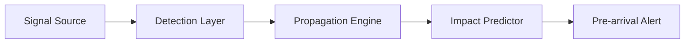

<p align="center">
  
</p>

<p align="center">
  <strong>Cross-Market Signal Propagation Protocol - Predict where signals land before they arrive</strong>
</p>

<p align="center">
  <a href="https://halcn.fun">
    
  </a>
  <a href="https://x.com/halcnHQ">
    
  </a>
  <a href="LICENSE">
    
  </a>
  
</p>

<p align="center">
  <a href="https://github.com/halcnlabs/halcn/actions/workflows/ci.yml">
    
  </a>
  
  
  
  
</p>

<p align="center">
  <a href="https://github.com/halcnlabs/halcn/stargazers">
    
  </a>
  
  
  
</p>

---

## Overview

halcn is a cross-market signal propagation protocol that detects, models, and predicts how trading signals propagate across interconnected markets. By analyzing the velocity, decay, and amplification patterns of signals as they traverse market boundaries, halcn delivers pre-arrival alerts before impact reaches downstream venues.

The core engine is built on Solana using the Anchor framework, with a TypeScript SDK for integration.

## Architecture



### Signal Flow

1. **Detection Layer** -- Ingests raw market data streams and isolates statistically significant signal events using configurable thresholds and sliding-window analysis.
2. **Propagation Engine** -- Models signal traversal across market pairs using weighted directed graphs. Each edge represents a measured correlation pathway with associated latency and decay parameters.
3. **Impact Predictor** -- Estimates the magnitude and timing of signal impact at downstream venues based on historical propagation patterns and current market microstructure.
4. **Pre-arrival Alert** -- Emits structured alerts with predicted impact vectors, confidence intervals, and estimated time-to-arrival.

## Features

| Feature | Description | Status |
|---------|-------------|--------|
| Signal Detection | Multi-source signal identification with configurable sensitivity | Active |
| Propagation Modeling | Weighted graph-based cross-market signal path computation | Active |
| Impact Prediction | Statistical impact estimation with confidence intervals | Active |
| Pre-arrival Alert | Real-time alert emission with sub-second latency targets | Active |

## Installation

```bash
git clone https://github.com/halcnlabs/halcn.git
cd halcn
```

### Build the on-chain program

```bash
cargo build-sbf
```

### Build the SDK

```bash
cd sdk
npm install
npm run build
```

## Usage

```typescript
import { HalcnClient } from "@halcn/halcn-sdk";

const client = new HalcnClient(connection, wallet);

// Detect a signal event
const signal = await client.detectSignal({
  source: "SOL/USDC",
  threshold: 0.02,
  windowMs: 5000,
});

// Get propagation path
const path = await client.getPropagationPath(signal.id);

// Subscribe to pre-arrival alerts
client.subscribeToAlerts((alert) => {
  console.log("Pre-arrival:", alert.target, alert.estimatedImpact);
});
```

## Program

Program ID: `Fg6PaFpoGXkYsidMpWTK6W2BeZ7FEfcYkg476zPFsLnS`

The on-chain program manages signal state, propagation path records, and impact prediction accounts. All instruction handlers validate signer authority and enforce account constraints via Anchor macros.

## Project Structure

```
halcn/
  programs/halcn-core/src/
    lib.rs                  -- Program entrypoint and instruction dispatch
    state.rs                -- Account state definitions
    errors.rs               -- Custom error codes
    constants.rs            -- Protocol constants
    events.rs               -- Event definitions for logging
    utils.rs                -- Shared utility functions
    instructions/
      mod.rs                -- Instruction module exports
      detect_signal.rs      -- Signal detection handler
      propagate.rs          -- Propagation modeling handler
      predict_impact.rs     -- Impact prediction handler
  sdk/src/
    index.ts                -- SDK entrypoint
    client.ts               -- HalcnClient class
    types.ts                -- TypeScript type definitions
    propagation.ts          -- Propagation utility functions
    constants.ts            -- SDK constants
    errors.ts               -- Error handling utilities
    utils.ts                -- Shared helpers
  sdk/tests/
    client.test.ts          -- Client and PDA tests
    propagation.test.ts     -- Propagation utility tests
  scripts/
    deploy.sh               -- Deployment automation
    test.sh                 -- Test runner
    setup-validator.sh      -- Local validator setup
```

## License

MIT -- see [LICENSE](LICENSE) for details.
